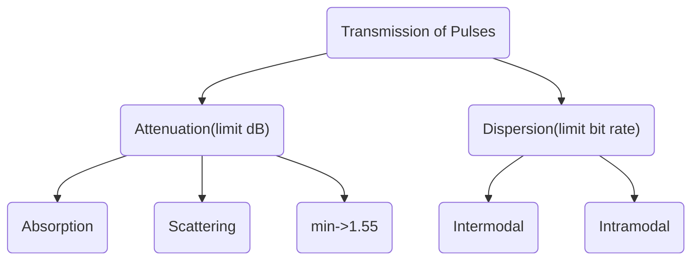
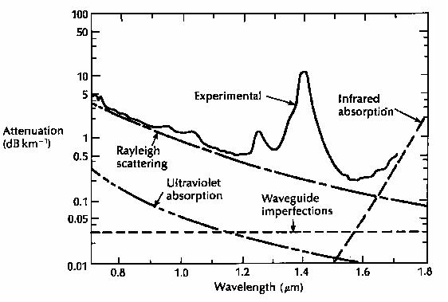
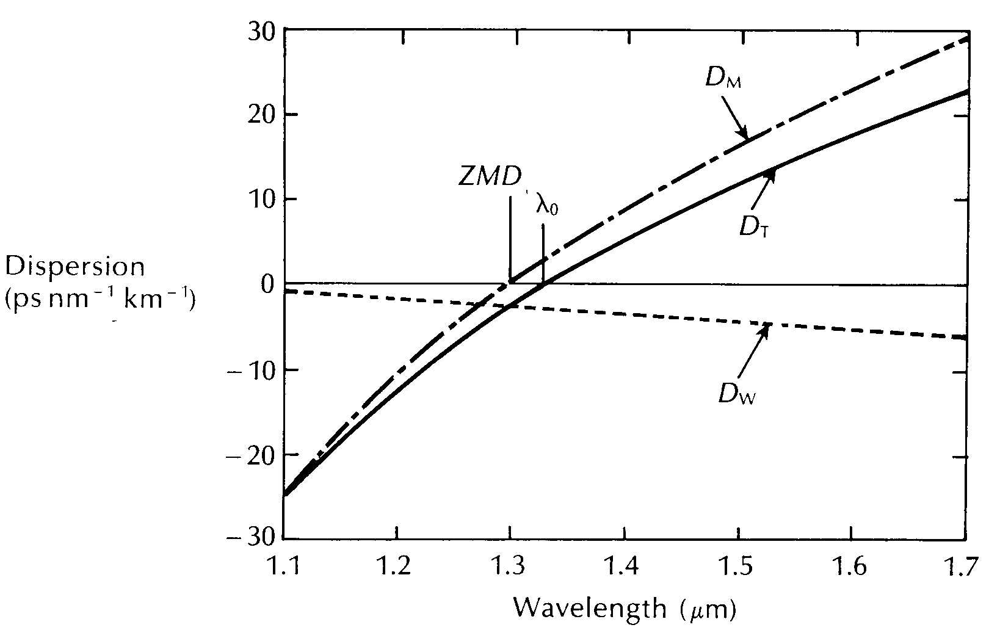
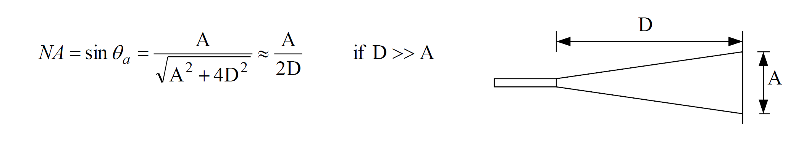

# Optical Communications

## Lecture 1

### Fiber Parameter:

$$
\begin{align}
NA=\sqrt{n_1^2-n_2^2}=n_1\sqrt{2\Delta}\\\\
    \Delta=\frac{n_1^2-n_2^2} {2n_1^2}\approx \frac{n_1-n_2}{n_1}
\end{align}
$$

### Pulse Broadening
$$
	\delta T = \frac{Ln_1}{c}\left(\frac{n_1}{n_2}-1\right)\sim 		\frac{Ln_1\Delta}{c}=\frac{L(NA)^2}{2cn_1}
$$

$$
	\sigma = \frac{Ln_1\Delta}{2\sqrt3 c}
$$

### Bit rate for RZ code
$$
    B_T(max)=\frac{1}{2\delta T}=\frac{0.2}{\sigma}
$$

## Lecture 2

**Mode index** or **Effective index**

$$
\frac{\beta}{k} \in [n_2,n_1)
$$

**Normalized Frequency**

$$
V=ak(n_1^2-n_2^2)^{1/2}=akNA=akn_1\sqrt{2\Delta}
$$

**Number of Modes**

$$
\frac{V^2}{2}
$$

**Normalized Propagation Constant**

$$
b=\frac{(\frac{\beta}{k})^2-n_2^2}{n_1^2-n_2^2}=\frac{W^2}{V^2}
$$

**Single-Mode Requirement**

$$
V \le 2.405
$$

## Lecture 3

{wdith="80%"}

### Attenuation

$$
    \alpha(dB/km)=-\frac{10}{L}lg(\frac{P_o}{P_i})
$$

$$
    P_o=P_i \times 10^{-\frac{\alpha L}{10}}
$$

### Intermodal Dispersion

**Intermodal Broadening**

$$
\sigma_n(ps \cdot  km^{-1}) = \frac{Ln_1\Delta}{2\sqrt3c}, L= 1km
$$

**Material Dispersion**

$$
\sigma_m(ps \cdot  km^{-1}) = \sigma_\lambda(nm)D_M(ps \cdot nm^{-1}\cdot km^{-1})
$$

$\sigma_\lambda$ : Optical Source

### Intramodal Dispersion
**Total Pulse Broadening(Test1 Q2)**

$$
    \sigma_T = \sigma_\lambda \cdot |D_T|
$$

$$
    D_T=D_M + D_W + D_p
$$

$D_p$ can be ignored.

$D_W$ can be ignored in multi-mode fiber

**Material Dispersion Parameter(Exercise3 Q5,7)**

$$
D_M=-\frac{\lambda}{c}\cdot\frac{d^2n}{d\lambda^2}
$$

**Waveguide Dispersion Parameter(Exercise3 Q3,4 )**

$$
    D_W = -\frac{n_1-n_2}{\lambda c}V\frac{d^2(bV)}{dV^2}
$$

**Dispersion Slope(Exercise3 Q6)**

$$
D_T(\lambda)=\frac{\lambda S_0}{4}\left[1-\left(\frac{\lambda_0}{\lambda}\right)^4\right]
$$

estimate $D_T$ near the minimum intramodal dispersion point

**Output Pulse Width and Power(Test1 Q3)**

$$
\sigma_o=\sqrt{\sigma_i^2+\sigma_T^2}
$$

$$
P_o=P_i \cdot \frac{\sigma_o}{\sigma_i}
$$

{width="75%"}

### Polarization Mode Dispersion(Exercise3 Q8,9)

**Modal Birefringence**

$$
B=\frac{\beta_x - \beta_y}{k}
$$

**Beat Length**

$$
L_B = \frac{2\pi}{\beta_x - \beta_y}=\frac{\lambda}{B}
$$

## Lecture 4

### Measurement of NA(Exercise4 Q3)

$$
NA = sin\theta_a=\frac{A}{\sqrt{A^2+4D^2}}\approx \frac{A}{2D}
$$
### Cut-back method(Exercise4 Q2)

$$
    \alpha=\frac{10}{L_1-L_2}lg\frac{P_{o2}}{P_{o1}}
$$

control `Launch Condition`, because we need to obtain a equilibrium modal power distribution and high-order modes have high attenuation per unit length which makes power distribution not uniform.

### Time Domain Measurement(Exercise4 Q4)

**3-dB pulse (full duration at half maximum) broadening**

$$
    \tau=\frac{\sqrt{\tau_o^2-\tau_i^2}}{L}
$$

**Bandwidth for Gaussian pulses**

$$
\sigma = 0.43\tau \\
    B = \frac{0.19}{\sigma}=\frac{0.44}{\tau}
$$